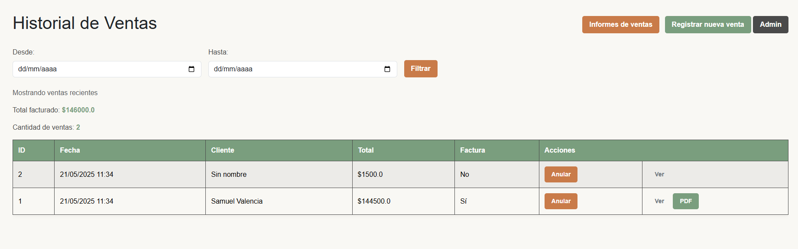
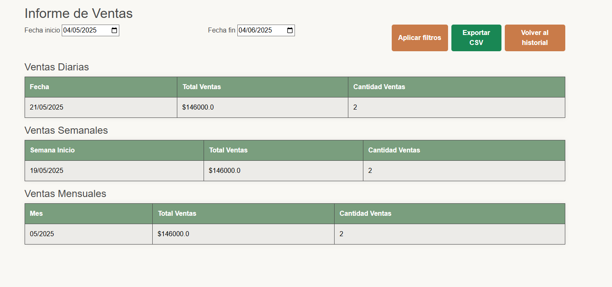
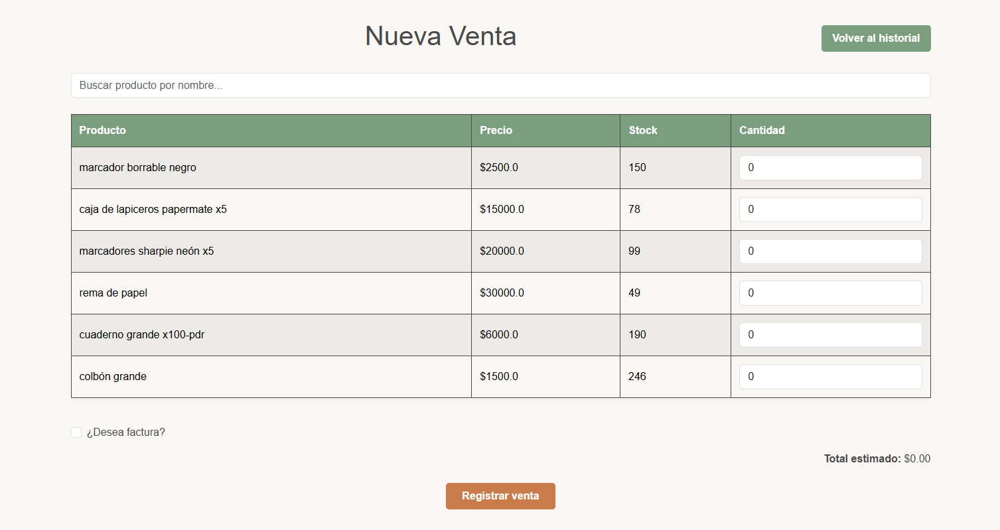
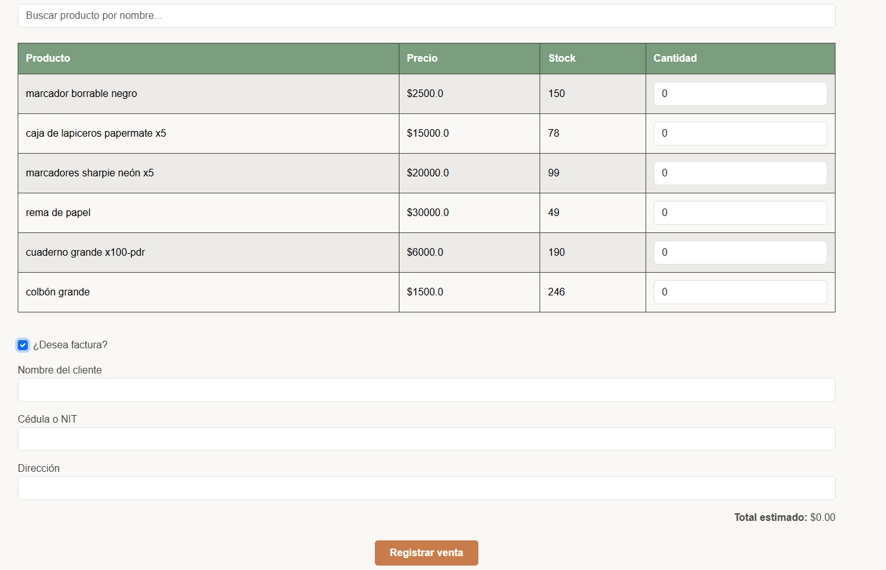
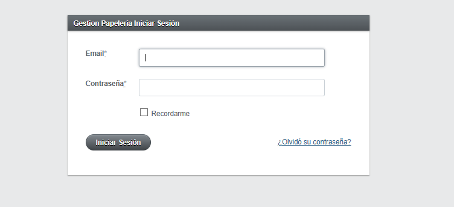
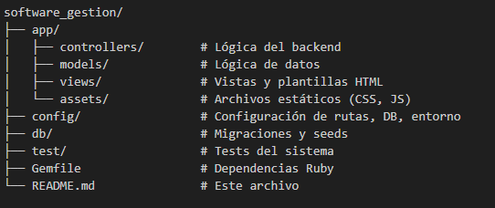

# README

# 📦 OptiStock

**OptiStock** es una aplicación web de gestión de inventario y ventas, desarrollada con **Ruby on Rails**. Está orientada a pequeñas y medianas empresas que necesitan una solución simple pero potente para controlar productos, ventas, facturación e informes, todo desde una interfaz web amigable.

---

## 🧭 Tabla de Contenidos

- [📦 OptiStock](#-optistock)
  - [🧭 Tabla de Contenidos](#-tabla-de-contenidos)
  - [🚀 Características](#-características)
  - [🛠️ Tecnologías](#-tecnologías)
  - [✅ Requisitos](#-requisitos)
  - [📦 Instalación](#-instalación)
  - [⚙️ Uso](#-uso)
    - [🧑 Roles](#-roles)
    - [🔍 Funcionalidades principales](#-funcionalidades-principales)
  - [📸 Capturas](#-capturas)
  - [🗂️ Estructura del Proyecto](#-estructura-del-proyecto)
  - [🔧 Mantenimiento](#-mantenimiento)

---

## 🚀 Características

- 🧑‍💼 Inicio de sesión para administradores y usuarios comunes
- 📋 CRUD completo de productos
- 💰 Registro de ventas con control automático de stock
- 🧾 Generación de facturas descargables (Excel o PDF)
- 📊 Informes de ventas diarios, semanales y mensuales
- 🔐 Sistema de autenticación básico

---

## 🛠️ Tecnologías

- **Ruby** `~> 3.3.6`
- **Ruby on Rails** `~> 7.1.5.1`
- **Base de datos**: PostgreSQL 
- **Frontend**: HTML, CSS, ERB (con Bootstrap opcional)
- **Backend**: MVC Rails
- **Control de versiones**: Git + GitHub

---

## ✅ Requisitos

- Ruby >= 3.3.6 
- Rails >= 7.1.5.1 
- PostgreSQL  
- Bundler (`gem install bundler`)  
- Git instalado  

---

## 📦 Instalación

**Revisar Archivo "Manual de Usuario" o "Manual Técnico" para más información** 

---

## ⚙️ Uso

### 🧑 Roles
**Administrador:**
Accede a todas las funcionalidades, incluyendo gestión de productos.

**Usuario común:**
Puede registrar ventas y visualizar informes, pero no modificar productos.


### 🔍 Funcionalidades principales
**Gestión de productos:**
Crear, editar y eliminar productos con stock y precio.

**Registro de ventas:**
Selección de productos vendidos, cantidad, y actualización automática del inventario.

**Facturación:**
Exportación de facturas en formatos Excel o PDF con detalle del cliente y venta.

**Informes:**
Visualización de totales de venta por día, semana o mes.

---
## 📸 Capturas 





 

---

## 🗂️ Estructura del Proyecto



---

## 🔧 Mantenimiento

**Actualizar gemas:**
```bash
bundle update
```

**Migraciones pendientes:**
```bash
rails db:migrate
```

**Verificar dependencias rotas:**
```bash
bundle check
```
---
